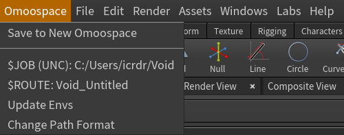

# Omoospace for Houdini

This is a houdini plugin of Omoospace.

[中文文档](https://uj6xfhbzp0.feishu.cn/wiki/IFcwwNWfci6TpwkW6mUcvcJmnVf?from=from_copylink)

# Getting Started

Before everything starts, you can understand the [Omoospace](https://omoolab.github.io/Omoospace/latest/omoospace/) to facilitate understanding of some of the proprietary terms mentioned below. Currently the plugin has only been tested on windows, other operating systems are unknown.

## Installation

Download the latest release version of Omoospace-Houdini (choose your houdini python version).
[https://github.com/OmooLab/Omoospace-Houdini/releases](https://github.com/OmooLab/Omoospace-Houdini/releases)

Unzip all files to any directory.  
e.g. `path/to/Omoospace-Houdini`

Reference it's package path to houdini package json file `houdiniX.Y/packages/env.json`.

```json
{
  "package_path": ["path/to/Omoospace-Houdini/Packages"]
}
```

Then restart Houdini.

## Usage

Some handy features to organize your project in omoospace ways.

- Get the current omoosapce and subspace route.
- Quick access to 5 main directories.
- Save the .hip file to the new omoospace.
- Organize nodes' import/export paths.

### Get current omoosapce and subspace route

Every time you open a .hip file, the plugin will read the [Omoospace](https://omoolab.github.io/Omoospace/latest/omoospace/#overview) root path of this file, as well as its [Subspace Route](https://omoolab.github.io/Omoospace/latest/omoospace/#a-subspace-route-is-formed-by-combining-the-subspace-names-from-root-to-leaf). If the plugin not detect any omoospace of current .hip file (e.g. when you first open Houdini with an empty project), it will refer to default omoospace `C:\Users\{UserName}\Void`, and the subspace route will be `Void_Untitled`

The omoospace root path is stored in `$JOB`, as it is the project root env defined by Houdini. So 5 main directories will be:

- Contents `$JOB/Contents`
- SourceFIles `$JOB/SourceFiles`
- ExternalData `$JOB/ExternalData`
- References `$JOB/References`
- StagedData `$JOB/StagedData`

All import export paths should be relative to `$JOB`.

According to the omoospace rules, all HDA files should be under `$JOB/Contents`. So every time a .hip file opens, this plugin will automatically add all HDAs from `$JOB/Contents` into this .hip. You can think of these HDAs as project-specific, rather than global.

The subspace route is stored in `$ROUTE`, this is not a built-in env of Houdini, but it also will be written into the file. So technically it will work even if without this plugin configured.

You can quickly access to `$JOB`, `$ROUTE` though main menu `Omoospace` on top bar.



They are not just for display, we add some funtions to them:

- If you want to open the Omoospace root directory in File Explorer, you click the `C:/Users/icrdr/Void`
- If you want to copy the Subspace Route to the clipboard, you click the `Void_Untitled`

> Anytime your manually move .hip file to new location in storage, `$JOB`, `$ROUTE` may change also. Remember to hit the botton "Omoospace - Update Substance Route" to update the envs. But if you "File - Save As" .hip, Even though the path is still changed, the plugin will automatically modify the environment variables for you whenever you execute the save.

### Quick access to 5 main directories.

5 main directories are added to the quick-access sidebar of the file selection dialog.


### Save the .hip file to the new omoospace.

If you need to start a new Omoospace, this feature will help you build it quickly, click Omoospace - Save to New Omoospace.
In the dialog, enter the name of the new Omoospace (required), and the name of the source file as Subspace (optional).


### Organize nodes' import/export paths.

Right-click on a node, press Organize Import Paths (hotkey Ctrl + Shift + E) to quickly set the parameters of the node with respect to the export paths.
For example, the Sublayer LOP node:


When clicked, the following dialog will appear. Here you can choose whether or not to copy the entire parent folder instead of individual files.


Right-click on a node, press Organize Export Paths (hotkey Ctrl + Shift + E) to quickly set the parameters of the node with respect to the export paths.
For example, the File Cache SOP node:


> "Organize Import/Export Paths" supports batch operation, you can select many nodes first and then execute them.

### Supported Nodes

Not all nodes currently support the "Organize Import/Export Paths" feature, and we can't predictably create presets for new nodes or set presets for other third-party nodes. Here is the list of currently supported nodes.

Want add more nodes support? Edit `nodes.json`

#### Import Paths

| **Node Type**                  | **Parameters**       |
| :----------------------------- | :------------------- |
| file                           | file                 |
| filemerge::2.0                 | filelist\*, file     |
| filemerge                      | file                 |
| lidarimport                    | filename             |
| rawimport                      | file                 |
| tableimport                    | file                 |
| usdimport                      | filepath1            |
| sublayer                       | filepath\*           |
| reference::2.0                 | filepath\*           |
| reference                      | filepath1            |
| assetreference                 | filepath             |
| kinefx::mocapimport            | asffile              |
| kinefx::fbxanimimport          | fbxfile              |
| kinefx::fbxcharacterimport     | fbxfile, animfbxfile |
| kinefx::fbxskinimport          | fbxfile              |
| lab::obj_importer              | sObjFile             |
| lab::osm_import                | osm_file             |
| lab::fbx_archive_import        | sFBXFile             |
| lab::terrain_layer_import::1.1 | sHeightmap           |
| lab::terrain_layer_import      | sHeightmap           |
| MaNan::OmooImport::1.0         | file_path            |
| MaNan::OmooReference::1.0      | file_path            |

#### Export Paths

| **Node Type**                        | **Parameters**                                                                                                                                                                                                                                                                                                                                                      |
| :----------------------------------- | :------------------------------------------------------------------------------------------------------------------------------------------------------------------------------------------------------------------------------------------------------------------------------------------------------------------------------------------------------------------ |
| subnet                               | lopoutput: `` $JOB/Contents/Scenes/`$ROUTE`_`$OS`/`$ROUTE`_`$OS`.usd ``                                                                                                                                                                                                                                                                                             |
| componentouput                       | filename: `` `$ROUTE`_`$OS`.usd `` <br> lopoutput: `` $JOB/Contents/Models/`$ROUTE`_`$OS`/`chs('filename')` ``                                                                                                                                                                                                                                                      |
| filecache::2.0                       | basename: `` `$ROUTE`_`$OS` `` <br> basedir: `$JOB/StagedData/FileCache`                                                                                                                                                                                                                                                                                            |
| filecache                            | file: `` $JOB/StagedData/FileCache/`$ROUTE`_`$OS`/`$ROUTE`_`$OS`.$F4.bgeo.sc `` <br> basename: `` `$ROUTE`_`$OS` `` <br> basedir: `$JOB/StagedData/FileCache`                                                                                                                                                                                                       |
| rop_alembic                          | filename: `` $JOB/Contents/Dynamics/`$ROUTE`_`$OS`/`$ROUTE`_`$OS`.$F4.abc ``                                                                                                                                                                                                                                                                                        |
| rop_gltf                             | file: `` $JOB/Contents/Models/`$ROUTE`_`$OS`/`$ROUTE`_`$OS`.glb ``                                                                                                                                                                                                                                                                                                  |
| rop_fbx                              | sopoutput: `` $JOB/Contents/Models/`$ROUTE`_`$OS`/`$ROUTE`_`$OS`.fbx ``                                                                                                                                                                                                                                                                                             |
| rop_geometry                         | sopoutput: `` $JOB/Contents/Dynamics/`$ROUTE`_`$OS`/`$ROUTE`_`$OS`.$F4.bgeo.sc ``                                                                                                                                                                                                                                                                                   |
| rop_geometryraw                      | sopoutput: `` $JOB/Contents/Dynamics/`$ROUTE`_`$OS`/`$ROUTE`_`$OS`.$F4.raw ``                                                                                                                                                                                                                                                                                       |
| vellumio::2.0                        | basename: `` `$ROUTE`_`$OS` `` <br> basedir: `$JOB/StagedData/VellumIO`                                                                                                                                                                                                                                                                                             |
| usdexport                            | lopoutput: `` $JOB/Contents/Models/`$ROUTE`_`$OS`/`$ROUTE`_`$OS`.usd ``                                                                                                                                                                                                                                                                                             |
| usd_rop                              | lopoutput: `` $JOB/Contents/Models/`$ROUTE`_`$OS`/`$ROUTE`_`$OS`.usd ``                                                                                                                                                                                                                                                                                             |
| karmarenderproperties                | picture: `` $JOB/Contents/Renders/`$ROUTE`_`$OS`/`$ROUTE`_`$OS`.$F4.exr ``                                                                                                                                                                                                                                                                                          |
| ropalembic                           | filename: `` $JOB/Contents/Dynamics/`$ROUTE`_`$OS`/`$ROUTE`_`$OS`.$F4.abc ``                                                                                                                                                                                                                                                                                        |
| ropcomposite                         | copoutput: `` $JOB/Contents/Renders/`$ROUTE`_`$OS`/`$ROUTE`_`$OS`.$F4.exr ``                                                                                                                                                                                                                                                                                        |
| ropfbx                               | sopoutput: `` $JOB/Contents/Models/`$ROUTE`_`$OS`/`$ROUTE`_`$OS`.fbx ``                                                                                                                                                                                                                                                                                             |
| ropgeometry                          | sopoutput: `` $JOB/Contents/Dynamics/`$ROUTE`_`$OS`/`$ROUTE`_`$OS`.$F4.bgeo.sc ``                                                                                                                                                                                                                                                                                   |
| ropusd                               | lopoutput: `` $JOB/Contents/Scenes/`$ROUTE`_`$OS`/`$ROUTE`_`$OS`.usd ``                                                                                                                                                                                                                                                                                             |
| ropkarma                             | picture: `` $JOB/Contents/Renders/`$ROUTE`_`$OS`/`$ROUTE`_`$OS`.$F4.exr ``                                                                                                                                                                                                                                                                                          |
| ropmantra                            | vm_picture: `` $JOB/Contents/Renders/`$ROUTE`_`$OS`/`$ROUTE`_`$OS`.$F4.exr ``                                                                                                                                                                                                                                                                                       |
| rop_comp                             | copoutput: `` $JOB/Contents/Renders/`$ROUTE`_`$OS`/`$ROUTE`_`$OS`.$F4.exr ``                                                                                                                                                                                                                                                                                        |
| dembones_skinningconverter::1.0      | sOutputFile: `` $JOB/Contents/Models/`$ROUTE`_`$OS`_Converted/`$ROUTE`_`$OS`_Converted.fbx ``                                                                                                                                                                                                                                                                       |
| geometry                             | sopoutput: `` $JOB/Contents/Dynamics/`$ROUTE`_`$OS`/`$ROUTE`_`$OS`.$F4.bgeo.sc ``                                                                                                                                                                                                                                                                                   |
| geometryraw                          | sopoutput: `` $JOB/Contents/Dynamics/`$ROUTE`_`$OS`/`$ROUTE`_`$OS`.$F4.raw ``                                                                                                                                                                                                                                                                                       |
| ifdarchive                           | arch_geofile1: `` $JOB/Contents/Scenes/`$ROUTE`_`$OS`/`$ROUTE`_`$OS`_001.archive.bgeo `` <br> arch_matfile1: `` $JOB/Contents/Scenes/`$ROUTE`_`$OS`/`$ROUTE`_`$OS`_001.material.ifd ``                                                                                                                                                                              |
| mdd                                  | file: `` $JOB/StagedData/MDD/`$ROUTE`_`$OS`/`$ROUTE`_`$OS`.mdd ``                                                                                                                                                                                                                                                                                                   |
| comp                                 | copoutput: `` $JOB/Contents/Renders/`$ROUTE`_`$OS`/`$ROUTE`_`$OS`.$F4.exr ``                                                                                                                                                                                                                                                                                        |
| haircardtex                          | vm_picture: `` $JOB/Contents/Images/`$ROUTE`_`$OS` `` <br> nameprefix: `` `$ROUTE`_`$OS` ``                                                                                                                                                                                                                                                                         |
| baketexture::3.0                     | vm_uvoutputpicture1: `` $JOB/Contents/Images/`$ROUTE`_`$OS`/`$ROUTE`_`$OS`_%(CHANNEL)s.%(UDIM)d.rat ``                                                                                                                                                                                                                                                              |
| baketexture::2.0                     | vm_uvoutputpicture1: `` $JOB/Contents/Images/`$ROUTE`_`$OS`/`$ROUTE`_`$OS`_%(CHANNEL)s.%(UDIM)d.rat ``                                                                                                                                                                                                                                                              |
| baketexture                          | vm_uvoutputpicture1: `` $JOB/Contents/Images/`$ROUTE`_`$OS`/`$ROUTE`_`$OS`_%(CHANNEL)s.%(UDIM)d.rat ``                                                                                                                                                                                                                                                              |
| karma                                | picture: `` $JOB/Contents/Renders/`$ROUTE`_`$OS`/`$ROUTE`_`$OS`.$F4.exr ``                                                                                                                                                                                                                                                                                          |
| dop                                  | dopoutput: `` $JOB/Contents/Dynamics/`$ROUTE`_`$OS`/`$ROUTE`_`$OS`.$SF.sim ``                                                                                                                                                                                                                                                                                       |
| ifd                                  | vm_picture: `` $JOB/Contents/Renders/`$ROUTE`_`$OS`/`$ROUTE`_`$OS`.$F4.exr ``                                                                                                                                                                                                                                                                                       |
| usd                                  | lopoutput: `` $JOB/Contents/Scenes/`$ROUTE`_`$OS`/`$ROUTE`_`$OS`.usd ``                                                                                                                                                                                                                                                                                             |
| usdzip                               | outfile1: `` $JOB/Contents/Models/`$ROUTE`_`$OS`/`$ROUTE`_`$OS`.usdz ``                                                                                                                                                                                                                                                                                             |
| alembic                              | filename: `` $JOB/Contents/Dynamics/`$ROUTE`_`$OS`/`$ROUTE`_`$OS`.$F4.abc ``                                                                                                                                                                                                                                                                                        |
| filmboxfbx                           | sopoutput: `` $JOB/Contents/Models/`$ROUTE`_`$OS`/`$ROUTE`_`$OS`.fbx ``                                                                                                                                                                                                                                                                                             |
| gltf                                 | file: `` $JOB/Contents/Models/`$ROUTE`_`$OS`/`$ROUTE`_`$OS`.glb ``                                                                                                                                                                                                                                                                                                  |
| hqueuescheduler                      | pdg_workingdir: `$JOB/StagedData/HQueueScheduler`                                                                                                                                                                                                                                                                                                                   |
| localscheduler                       | pdg_workingdir: `$JOB/StagedData/LocalScheduler`                                                                                                                                                                                                                                                                                                                    |
| topnet                               | checkpointfile: `` $JOB/StagedData/TopNetwork/`$ROUTE`_`$OS`_Checkpoint.json ``                                                                                                                                                                                                                                                                                     |
| lopnet                               | rendergallerysource: `` $JOB/StagedData/Galleries/`$ROUTE`_`$OS`/Rendergallery.db ``                                                                                                                                                                                                                                                                                |
| kinefx::rop_gltfcharacteroutput      | filepath: `` $JOB/Contents/Models/`$ROUTE`_`$OS`/`$ROUTE`_`$OS`.glb ``                                                                                                                                                                                                                                                                                              |
| kinefx::rop_fbxcharacteroutput       | outputfilepath: `` $JOB/Contents/Models/`$ROUTE`_`$OS`/`$ROUTE`_`$OS`.fbx ``                                                                                                                                                                                                                                                                                        |
| kinefx::filmboxfbxcharacter          | outputfilepath: `` $JOB/Contents/Models/`$ROUTE`_`$OS`/`$ROUTE`_`$OS`.fbx ``                                                                                                                                                                                                                                                                                        |
| kinefx::gltfcharacter                | filepath: `` $JOB/Contents/Models/`$ROUTE`_`$OS`/`$ROUTE`_`$OS`.glb ``                                                                                                                                                                                                                                                                                              |
| kinefx::filmboxfbxanimation          | outputfilepath: `` $JOB/Contents/Models/`$ROUTE`_`$OS`/`$ROUTE`_`$OS`.fbx ``                                                                                                                                                                                                                                                                                        |
| labs::impostor_texture               | output_sequence: `` $JOB/Contents/Renders/`$ROUTE`_`$OS`/`$ROUTE`_`$OS`.$F4.exr `` <br> beauty_atlas: `` $JOB/Contents/Renders/`$ROUTE`_`$OS`/`$ROUTE`_`$OS`_Beauty.exr `` <br> base_color_atlas: `` $JOB/Contents/Renders/`$ROUTE`_`$OS`/`$ROUTE`_`$OS`_BaseColor.exr `` <br> normals_atlas: `` $JOB/Contents/Renders/`$ROUTE`_`$OS`/`$ROUTE`_`$OS`_Normals.exr `` |
| labs::niagara_rop                    | outputpath: `` $JOB/Contents/Dynamics/`$ROUTE`_`$OS`/`$ROUTE`_`$OS`.hbjson ``                                                                                                                                                                                                                                                                                       |
| labs::xyz_pointcloud_exporter        | csv_path: `` $JOB/Contents/Dynamics/`$ROUTE`_`$OS`/`$ROUTE`_`$OS`.xyz ``                                                                                                                                                                                                                                                                                            |
| labs::filecache::2.0                 | basename: `` `$ROUTE`_`$OS` `` <br> basedir: `$JOB/StagedData/FileCache`                                                                                                                                                                                                                                                                                            |
| labs::filecache::1.0                 | basename: `` `$ROUTE`_`$OS` `` <br> basedir: `$JOB/StagedData/FileCache`                                                                                                                                                                                                                                                                                            |
| labs::niagara::2.0                   | outputpath: `` $JOB/Contents/Dynamics/`$ROUTE`_`$OS`/`$ROUTE`_`$OS`.hbjson ``                                                                                                                                                                                                                                                                                       |
| labs::niagara                        | csvpath: `` $JOB/Contents/Dynamics/`$ROUTE`_`$OS`/`$ROUTE`_`$OS`.csv ``                                                                                                                                                                                                                                                                                             |
| labs::dembones_skinningconverter     | sExportFile: `` $JOB/Contents/Models/`$ROUTE`_`$OS`_Converted/`$ROUTE`_`$OS`_Converted.fbx ``                                                                                                                                                                                                                                                                       |
| labs::karma::2.0                     | basename: `` `$ROUTE`_`$OS` `` <br> basedir: `$JOB/Contents/Renders`                                                                                                                                                                                                                                                                                                |
| labs::ropkarma::2.0                  | basename: `` `$ROUTE`_`$OS` `` <br> basedir: `$JOB/Contents/Renders`                                                                                                                                                                                                                                                                                                |
| labs::3d_facebook_image              | picture: `` $JOB/Contents/Images/`$ROUTE`_`$OS`/`$ROUTE`_`$OS`.png ``                                                                                                                                                                                                                                                                                               |
| labs::marmoset_export::1.0           | vm_picture2: `` $JOB/Contents/Renders/`$ROUTE`_`$OS`/`$ROUTE`_`$OS`.mview `` <br> vm_picture: `` $JOB/Contents/Renders/`$ROUTE`_`$OS`/`$ROUTE`_`$OS`.png ``                                                                                                                                                                                                         |
| labs::marmoset_export                | vm_picture2: `` $JOB/Contents/Renders/`$ROUTE`_`$OS`/`$ROUTE`_`$OS`.mview `` <br> vm_picture: `` $JOB/Contents/Renders/`$ROUTE`_`$OS`/`$ROUTE`_`$OS`.png ``                                                                                                                                                                                                         |
| labs::games_baker::2.0               | base_path: `` $JOB/Contents/Models/`$ROUTE`_`$OS`/Textures/`$ROUTE`_`$OS`_$(CHANNEL).tga `` <br> tempdirectory: `$JOB/StagedData/LabsGamesBaker`                                                                                                                                                                                                                    |
| labs::games_baker                    | base_path: `` $JOB/Contents/Models/`$ROUTE`_`$OS`/Textures/`$ROUTE`_`$OS`_$(CHANNEL).tga ``                                                                                                                                                                                                                                                                         |
| labs::rbd_to_fbx::3.0                | export_path: `` $JOB/Contents/Models/`$ROUTE`_`$OS`/`$ROUTE`_`$OS`.fbx ``                                                                                                                                                                                                                                                                                           |
| labs::rbd_to_fbx::2.0                | export_path: `` $JOB/Contents/Models/`$ROUTE`_`$OS`/`$ROUTE`_`$OS`.fbx ``                                                                                                                                                                                                                                                                                           |
| labs::rbd_to_fbx                     | export_path: `` $JOB/Contents/Models/`$ROUTE`_`$OS`/`$ROUTE`_`$OS`.fbx ``                                                                                                                                                                                                                                                                                           |
| labs::csv_exporter                   | export_path: `` $JOB/Contents/Dynamics/`$ROUTE`_`$OS`/`$ROUTE`_`$OS`.csv ``                                                                                                                                                                                                                                                                                         |
| labs::json_exporter::1.0             | json_path: `` $JOB/Contents/Dynamics/`$ROUTE`_`$OS`/`$ROUTE`_`$OS`.json ``                                                                                                                                                                                                                                                                                          |
| labs::vertex_animation_textures::3.0 | exportpath: `$JOB/Contents/Dynamics` <br> assetname: `` `$ROUTE`_`$OS` ``                                                                                                                                                                                                                                                                                           |
| labs::vertex_animation_textures::2.1 | project: `` $JOB/Contents/Dynamics/`$ROUTE`_`$OS` ``                                                                                                                                                                                                                                                                                                                |
| labs::vertex_animation_textures::2.0 | project: `` $JOB/Contents/Dynamics/`$ROUTE`_`$OS` ``                                                                                                                                                                                                                                                                                                                |
| labs::vertex_animation_textures      | export_geo_path: `` $JOB/Contents/Dynamics/`$ROUTE`_`$OS`/`$ROUTE`_`$OS`.mesh.fbx `` <br> export_position_path: `` $JOB/Contents/Dynamics/`$ROUTE`_`$OS`/`$ROUTE`_`$OS`.pos.exr ``                                                                                                                                                                                  |
| labs::flipbook_textures::1.0         | expdir: `$JOB/Contents/Dynamics` <br> asset: `` `$ROUTE`_`$OS` ``                                                                                                                                                                                                                                                                                                   |
| MaNan::OmooExport::1.1               | name: `` `$ROUTE`_`$OS` `` <br> export_dir: `$JOB/Contents/Models` <br> cache_dir: `$JOB/StagedData/OmooExport`                                                                                                                                                                                                                                                     |
| MaNan::OmooSopImport::1.0            | name: `` `$ROUTE`_`$OS` ``                                                                                                                                                                                                                                                                                                                                          |
| MaNan::SubstanceBridge::1.1          | name: `` `$ROUTE`_`$OS` `` <br> bridge_dir: `$JOB/StagedData/SubstanceBridge` <br> backup_dir: `$JOB/Contents/Models/SubstanceBridge` <br> cache_dir: `$JOB/StagedData/SubstanceBridge`                                                                                                                                                                             |
| MaNan::ZbrushBridge::1.5             | name: `` `$ROUTE`_`$OS` `` <br> bridge_dir: `$JOB/StagedData/ZbrushBridge` <br> backup_dir: `$JOB/Contents/Models/ZbrushBridge`                                                                                                                                                                                                                                     |


# For Contributors

## Dependencies

- Python >= 3.9
- Houdini >= 19.5

Pull this repository.

```bash
$ git clone https://github.com/OmooLab/Omoospace-Houdini.git
$ cd Omoospace-Houdini
```

Create env folder.

```bash
$ pyenv global 3.10.10 # <- choose your python verison of houdini
$ python -m venv pythonlib3.10 # <- if python3.9 change it to pythonlib3.9
$ source pythonlib3.10/Scripts/activate
```

Install dependencies.

```bash
$ pip install -r requirements.txt
```
